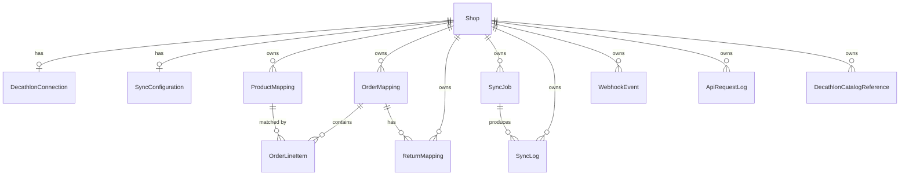

# Database Design

Full schema: [`prisma/schema.prisma`](../prisma/schema.prisma). This document explains the ERD and
the reasoning behind entities that differ from the original generic brief.

## 1. Naming reflects the confirmed direction

The original brief's entity list (`Product`, `ProductVariant`, `Inventory`, `Price` as separate
tables) assumed Decathlon's catalogue gets pulled into Shopify. Since the confirmed model is the
reverse (Shopify products get pushed to Decathlon as listings), there is no need for a local
`Product`/`ProductVariant`/`Inventory`/`Price` cache table — **Shopify is the source of truth** for
that data via its Admin API. Duplicating it locally would be a sync-integrity liability (two sources
of truth) with no benefit.

Instead, `ProductMapping` is the single row-per-listing table: it links a Shopify variant to its
Decathlon product/offer identity and tracks sync state. This is simpler and matches requirement §6's
own `ProductMapping` design intent while dropping the now-unnecessary `Product`/`Inventory`/`Price`
tables.

## 2. ERD

## 3. Duplicate-prevention constraints (mandatory per requirement §13)

| Constraint | Table | Purpose |
|---|---|---|
| `@@unique([shopId, shopifyVariantId])` | `ProductMapping` | one mapping row per Shopify variant per shop |
| `@@unique([shopId, decathlonOrderId])` | `OrderMapping` | **the core anti-duplicate-order guarantee** — re-running order import never creates a second Shopify order for the same Decathlon order |
| `@@unique([shopId, shopifyOrderId])` | `OrderMapping` | one mapping per Shopify order |
| `@@unique([shopId, decathlonReturnId])` | `ReturnMapping` | idempotent return creation |
| `@@unique([shopId, type, key])` | `DecathlonCatalogReference` | one cached copy per hierarchy/attribute/value-list key |

The order-import job flow is always: `findUnique({shopId, decathlonOrderId})` → if found, short-circuit
and return the existing mapping; if not found, create inside a transaction that also writes the
`OrderMapping` row, so a concurrent duplicate run collides on the unique constraint rather than racing.

## 4. Multi-tenancy

Every table that isn't purely global (there are none) carries `shopId` with a foreign key to `Shop`
and `onDelete: Cascade`, so uninstalling an app/deleting a shop cleans up its data. Every repository
method in `packages/database` must take `shopId` as its first parameter — this is enforced by code
review, not just convention (see `docs/architecture.md` §8).

## 5. Secrets at rest

- `Shop.shopifyAccessToken` and `DecathlonConnection.apiKeyEncrypted` are encrypted at the application
  layer (AES-256-GCM, key from `ENCRYPTION_KEY` env var) before insert, decrypted only inside
  `packages/shopify` / `packages/decathlon` respectively.
- `SyncLog.requestSummary` / `responseSummary` and `ApiRequestLog.*Masked` fields must have
  Authorization headers, API keys, and access tokens stripped/masked by `packages/logger` before the
  row is written — never store raw headers.

## 6. Why `SyncJob` and `SyncLog` are separate

`SyncJob` is the BullMQ-tracked unit of work (one row per enqueued job, carries progress for the UI's
"2,350 / 12,450" style progress bar). `SyncLog` is a finer-grained audit trail — a single `product-sync`
`SyncJob` processing 500 products produces 500 `SyncLog` rows (or one per failure, configurable), each
independently queryable/filterable on the Logs page, and diffable by `correlationId` back to the
originating `ApiRequestLog` rows for full request/response drill-down.

## 7. Indexes

Indexes are placed for the dashboard/log-list query patterns described in the brief:
`(shopId, sku)`, `(shopId, decathlonProductId)`, `(shopId, status)` on `ProductMapping`;
`(shopId, decathlonOrderStatus)` on `OrderMapping`; `(shopId, type, status, createdAt)` on `SyncLog`
for the paginated logs page; `(correlationId)` on both `SyncLog` and `ApiRequestLog` for drill-down.

## 8. Open question for Phase 2

`OrderLineItem.unitPrice`/`taxAmount`/`discountAmount` are typed `Decimal(12,2)` assuming Decathlon
returns money as decimal strings/numbers, not minor-unit integers (cents). This needs confirming once
an actual OR11 response payload is available — flagged, not assumed silently.
